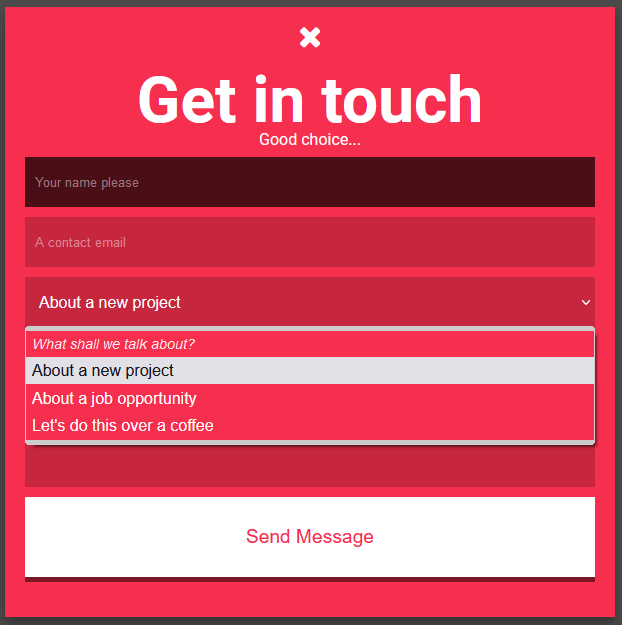
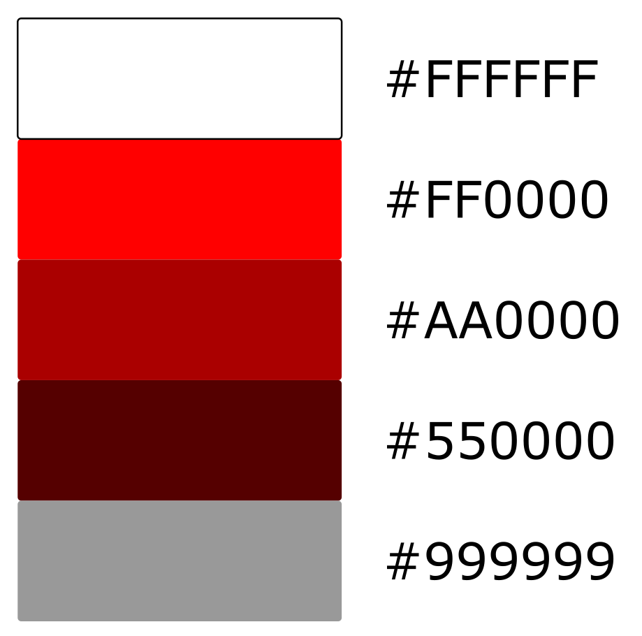

# Evaluación UD5 CSS

El diseñador de contenidos nos ha entregado el siguiente Layaout para que lo maquetemos:

Con la siguiente carta de colores:

El programador nos ha entregado el código y tan solo debemos insertar los elementos de diseño que nos sean necesarios para poder obtener el diseño que nos han pedido.

Podemos descargar el proyecto del repositorio de GIT:

[Descarga proyecto en GIT](https://github.com/JJPS/ExamenUD5CSS.git)

Debes entregar en un fichero comprimido:

- Página HTML
- Hoja de estilos CSS
- Captura de pantalla del resultado

Suerte
